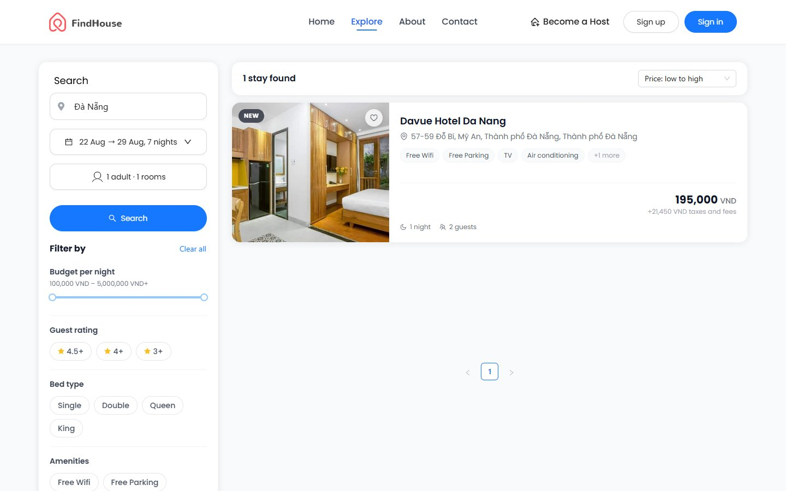
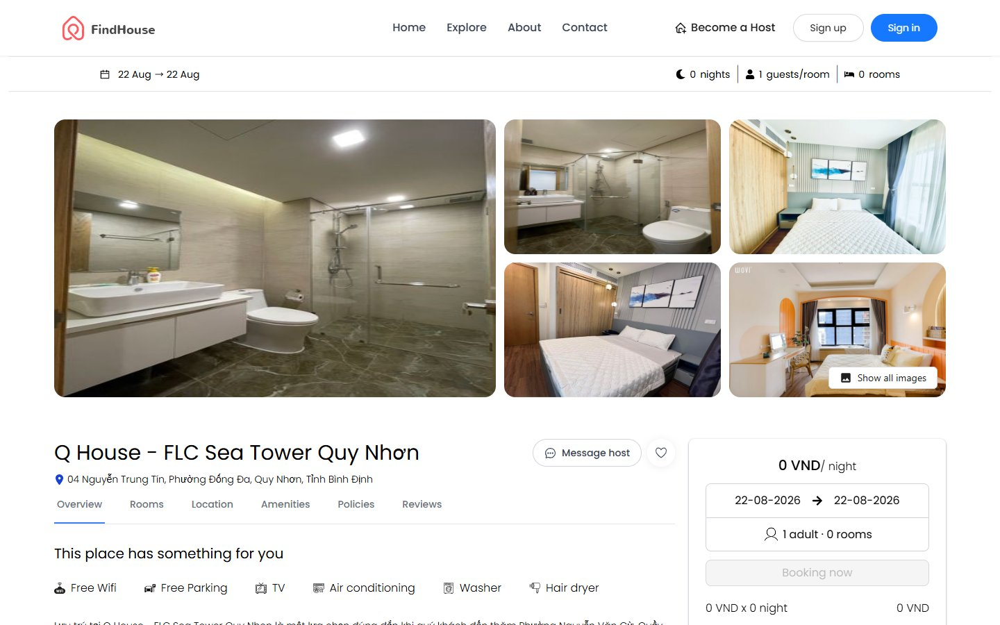
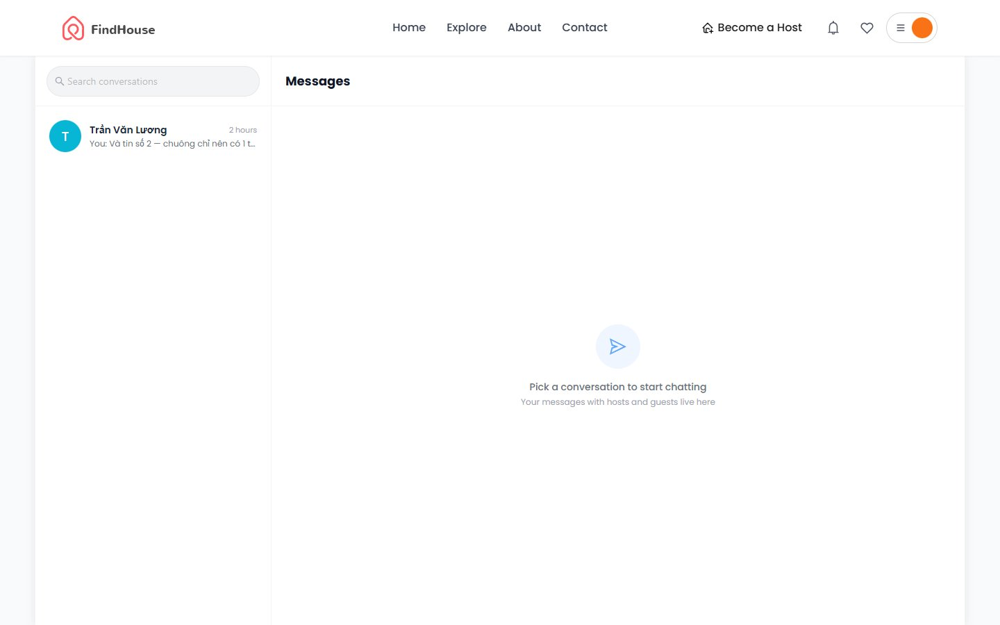

# Rent Apartment 🏠

A full-stack apartment & homestay booking platform — search stays with full-text/fuzzy matching, book rooms with daily pricing, pay with Stripe, and manage your own rental listings as a host.

## Preview


| Search & filters | Apartment detail | Messenger |
|---|---|---|
|  |  |  |

## Table of Contents

- [Preview](#preview)
- [Features](#features)
- [Tech Stack](#tech-stack)
- [Project Structure](#project-structure)
- [Getting Started](#getting-started)
  - [Prerequisites](#prerequisites)
  - [1. Clone & install](#1-clone--install)
  - [2. Environment variables](#2-environment-variables)
  - [3. Start Elasticsearch (Docker)](#3-start-elasticsearch-docker)
  - [4. Run the apps](#4-run-the-apps)
- [Available Scripts](#available-scripts)
- [API Documentation](#api-documentation)
- [Architecture Notes](#architecture-notes)

## Features

- **Authentication** — email registration with confirmation mail, Google & Facebook OAuth. JWT access tokens + httpOnly-cookie refresh tokens with automatic single-flight refresh on the client.
- **Search** — Elasticsearch-powered full-text search: diacritics-insensitive (`da nang` → *Đà Nẵng*), typo-tolerant (fuzzy), with graceful fallback to MongoDB when ES is down. Filters by dates, guests, rooms and price with availability checking.
- **Booking** — multi-room booking flow with daily room rates, Stripe payment, confirmation emails, and a "My bookings" page with status tracking (pending / confirmed / completed / canceled).
- **Favorites** — save stays to a wishlist, synced across the app.
- **Host dashboard** — create/manage apartments and rooms, calendar with daily pricing, booking management.
- **API docs** — auto-generated OpenAPI (Swagger UI) from Zod schemas.

## Tech Stack

| Layer | Technologies |
|---|---|
| **Client** | Next.js 13 (App Router), React 18, TypeScript, Ant Design, TailwindCSS, TanStack Query, React Hook Form, Axios |
| **Server** | Node.js, Express, TypeScript, Mongoose (MongoDB Atlas), Zod, Passport (Google/Facebook), JWT, Nodemailer, Stripe, Pino |
| **Search** | Elasticsearch 8 (Docker), custom `vi_folding` analyzer |
| **Tooling** | tsx, tsup, ESLint + Prettier, Vitest, Docker Compose |

## Project Structure

```
Rent_Apartment/
├── client/                     # Next.js 13 App Router
│   └── src/
│       ├── app/                # App Router: layouts + route pages (CSR wrappers)
│       ├── apis/               # Axios instance + API functions per domain
│       ├── components/         # Reusable UI (Header, Search, FavoriteButton, ...)
│       ├── contexts/           # Auth context (reducer + session handling)
│       ├── hooks/
│       ├── lib/                # router-compat (react-router-like API on next/navigation)
│       ├── views/              # Page-level components (public / user / host)
│       └── utils/
│
└── server/                     # Express API
    ├── docker-compose.yml      # Elasticsearch
    ├── scripts/                # One-off scripts (ES bulk reindex)
    ├── templates/              # HTML email templates
    └── src/
        ├── api/                # Feature modules — each owns its full stack:
        │   └── <feature>/      #   <feature>.router.ts     (routes + OpenAPI registry)
        │       ...             #   <feature>.controller.ts (req/res handling)
        │                       #   <feature>.service.ts    (business logic)
        │                       #   <feature>.model.ts      (Mongoose model)
        │                       #   <feature>.dto.ts        (Zod schemas + types)
        │       # modules: amenity, apartment, auth, booking, health,
        │       #          image, payment, pricing, room, user
        ├── api-docs/           # OpenAPI document generator (Swagger)
        ├── config/             # db, env (envalid), passport
        ├── middlewares/        # errorHandler, rateLimiter, requestLogger,
        │                       # uploadFile, verifyToken
        ├── routes/             # Route mounting + swagger router
        ├── services/           # Cross-cutting: mail, stripe, apartmentSearch (ES)
        ├── types/              # Global type declarations
        ├── utils/              # jwt, zodTransforms, httpHandlers, serviceResponse
        ├── server.ts           # Express app assembly
        └── index.ts            # Entry point
```

## Getting Started

### Prerequisites

- **Node.js** ≥ 20 — developed on Node 24 LTS (see `.nvmrc`)
- **Docker Desktop** — for Elasticsearch
- A **MongoDB** database (e.g. free [MongoDB Atlas](https://www.mongodb.com/atlas) cluster)
- Optional for full functionality: Gmail app password (emails), Stripe test keys (payments), Google/Facebook OAuth credentials

### 1. Clone & install

```bash
git clone https://github.com/dient16/rent-apartment.git
cd rent-apartment

# server
cd server && npm install

# client
cd ../client && npm install
```

### 2. Environment variables

Create `.env` files from the provided examples and fill in your values:

```bash
cp server/.env.example server/.env
cp client/.env.example client/.env.local
```

**Server** (`server/.env`) — key variables:

| Variable | Description | Example |
|---|---|---|
| `PORT` / `HOST` | API host/port | `9009` / `localhost` |
| `SERVER_URL` | Public URL of the API (used in image links, mails) | `http://localhost:9009` |
| `CLIENT_URL` / `CORS_ORIGIN` | Frontend URL | `http://localhost:8000` |
| `MONGODB_URL` | MongoDB connection string | `mongodb+srv://...` |
| `ELASTICSEARCH_URL` | Elasticsearch endpoint | `http://localhost:9200` |
| `JWT_ACCESS_KEY` / `JWT_REFRESH_KEY` | JWT signing secrets (any long random strings) | — |
| `ACCESS_TOKEN_TTL` / `REFRESH_TOKEN_TTL` | Token lifetimes | `15m` / `7d` |
| `EMAIL_NAME` / `EMAIL_APP_PASSWORD` | Gmail address + [app password](https://support.google.com/accounts/answer/185833) for sending mails | — |
| `STRIPE_SECRET_KEY` | Stripe secret key (test mode) | `sk_test_...` |
| `GOOGLE_*` / `FACEBOOK_*` | OAuth credentials | — |

**Client** (`client/.env.local`):

| Variable | Description |
|---|---|
| `NEXT_PUBLIC_SERVER_URL` | API base URL (`http://localhost:9009`) |
| `NEXT_PUBLIC_STRIPE_PUBLISHABLE_KEY` | Stripe publishable key (`pk_test_...`) |
| `NEXT_PUBLIC_API_MAP` | Map API key (optional) |

### 3. Start Elasticsearch (Docker)

```bash
cd server
npm run es:up        # docker compose up -d elasticsearch
npm run es:reindex   # index existing apartments from MongoDB
```

> Elasticsearch is **optional in development** — if it isn't running, search automatically falls back to MongoDB regex matching (less powerful: no fuzzy/diacritics-insensitive matching). The server also auto-reconnects and syncs new/updated apartments once ES comes up.

### 4. Run the apps

```bash
# terminal 1 — API on http://localhost:9009
cd server && npm run dev

# terminal 2 — client on http://localhost:8000
cd client && npm run dev
```

> The client **must** run on the port configured in `CORS_ORIGIN` (default `8000`), otherwise browser requests are blocked by CORS.

Open http://localhost:8000 🎉

## Available Scripts

**Server** (`server/`):

| Script | Description |
|---|---|
| `npm run dev` | Dev server with hot reload (tsx watch + pino-pretty) |
| `npm run build` | Production build (tsup → `dist/`) |
| `npm start` | Run the production build |
| `npm run typecheck` | TypeScript check without emitting |
| `npm run lint` / `lint:fix` | ESLint |
| `npm test` | Vitest |
| `npm run es:up` | Start Elasticsearch container |
| `npm run es:reindex` | Bulk reindex all apartments into Elasticsearch |

**Client** (`client/`):

| Script | Description |
|---|---|
| `npm run dev` | Next.js dev server (port 8000) |
| `npm run build` | Next.js production build |
| `npm run start` | Serve the production build (port 8000) |
| `npm run lint` | ESLint |

## API Documentation

With the server running, Swagger UI is available at:

```
http://localhost:9009/api-docs
```

The OpenAPI document is generated from the Zod schemas registered in each feature's router (raw JSON at `/api-docs/swagger.json`).

## Architecture Notes

- **Feature-module layout** — each domain under `src/api/<feature>/` owns its router, controller, service, model and DTOs. Cross-cutting infrastructure (mail, Stripe, Elasticsearch) lives in `src/services/`.
- **Auth flow** — short-lived JWT access token (client memory/localStorage) + long-lived refresh token in an **httpOnly cookie** (never exposed to JS). The Axios interceptor performs a *single-flight* refresh: concurrent 401s wait on one refresh request, then retry. Logout revokes the refresh token server-side.
- **Search pipeline** — Elasticsearch resolves the free-text part (diacritics folding + fuzziness) into apartment IDs; a single MongoDB aggregation starting from `rooms` then filters availability/price/guests, groups per apartment (cheapest available room first) and paginates with a stable sort. ES writes are synced on apartment create/update/delete.
- **Validation & responses** — request validation with Zod (`validateRequest` middleware), uniform `ServiceResponse` envelope, centralized error handler, request logging via pino (compact single-line format in dev).
